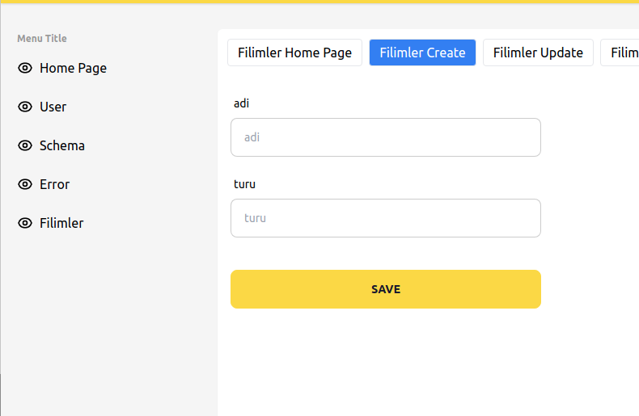

# vue-cli
**vue-cli** **node.js** kullanılarak oluşturulmuş ve terminal aracılığı ile kullanılması amaçlanmıştır. Terminal kodlarını kullanarak vue3 alt yapısında hızlıca proje taslağı oluşturmanızı sağlar. 
Bunun için iki adet terminal komutu kullanır. 

> vue-cli --install <proje_adi>
> vue-cli --table <tablo_adi>

Help komutu kullanarak terminalde kullanabileceğimiz kodlara ve kullanımlarına erişebilirsiniz.

> vue-cli --help 

# Kurulumu

Öncelikle repoyu bilgisayarınızda daha sonra değiştirmeyeceğiniz bir dizine klonlayın. 

İlgili dizini seçtikten sonra aşağıdaki kodu kullanarak repoyu bilgisayarınıza klonlayabilirsiniz.

> git clone https://github.com/koneviahmet/vue3-cli.git

Klonlama bittikten sonra projenin kurulu olduğu dizine giriniz.

> cd vue3-cli
>
> npm i

npm i komutu ile projenin bağımlılıklarını kuruyoruz. vue-cli komutumuzun terminalde çalışabilmesi için repoyu globala kurmamız gerekiyor bunun içinde aşağıdaki kodları terminale giriyoruz.

> npm i -g

linux için

> sudo npm i -g 

Yukarıdaki komut ile beraber artık istedimiz dizinde **vue-cli** terminal koduna erişebiliriz.

# Örnek proje 

Projenin çalışma mantığını anlamak için basit bir film sitesi uygulaması yapalım. Backend kısmında sahte api çalıştırmak için 

**json-server** (https://github.com/typicode/json-server) reposunu kullanıyoruz.  Film sitesini oluşturduktan sonra backendimizin çalışması için json-serverın kutulması gerekmektedir. Kurulum için yukarıdaki linki ziyaret edebilirsiniz.

## Örnek proje kurulum aşamaları

* Terminali açın ve uygun bir klasöre gidiniz.

* > vue-cli --install film_sitesi 
  >
  > #film sitesi adında bir proje oluşturduk

* > cd film_sitesi 
  >
  > #projenin bulunduğu klasöre girdik

* > npm i 
  >
  > #film sitesinin bağımlılıklarını kurduk

* > npm run dev 
  >
  > #projeyi başlattık

* > npm run db
  >
  > #sahte backendi ayağa kaldırdık.

* SignUp diyerek kaydolabilir ve login diyerek sisteme giriş yapabilirsiniz.

* Şimdi fil sitesi için gerekli olan tabloyu oluşturalım

* > vue-cli --table filmler
  > #filmler isminde bir tablo oluşturduk

  

* Tablomuzun kaç satırdan oluşacağını ve isimlerinin ne olacağını sıracak. örneğin **adi** ve **turu** şeklinde iki satırdan oluştuğunu var sayalım. Tablo kaç satırdan oluşacak sorusuna iki cevabını veriyoruz. ve sonraki sorulan sorulara da adi ve turu cevaplarını veriyoruz. Bizim için uygun kurulumu yapacaktır.

   

* Yulkarıdaki resimde olduğu gibi filmler menusü oluşturuldu. Filmler menüsünden neler yapabiliriz ?
  * Filimler ana sayfası. (http://localhost:3000/#/filimler) bu kısmı projenizin durumuna göre düzenleyebilsiniz.
  * Filimler ekleme sayfası (http://localhost:3000/#/filimler/create)
  * Eklenen filimleri düzenleme sayfası (http://localhost:3000/#/filimler/update/1)
  * Eklenen filimleri listeleme sayfası (http://localhost:3000/#/filimler/list)
  * Filimlerin detayını görebileceğiniz detay sayfası (http://localhost:3000/#/filimler/detail/1)
  * Filimleri arayabileceğiniz arama sayfası (http://localhost:3000/#/filimler/search)

**Önemli Not**: Backend sahte api ile oluşturulduğu içn giriş, arama vb. sayfalarda kriterlere uygun davranılmamıştır. Bu kısımlar gerçek api kullanırken apinin ihtiyaçlarına göre düzenlenmelidir.
